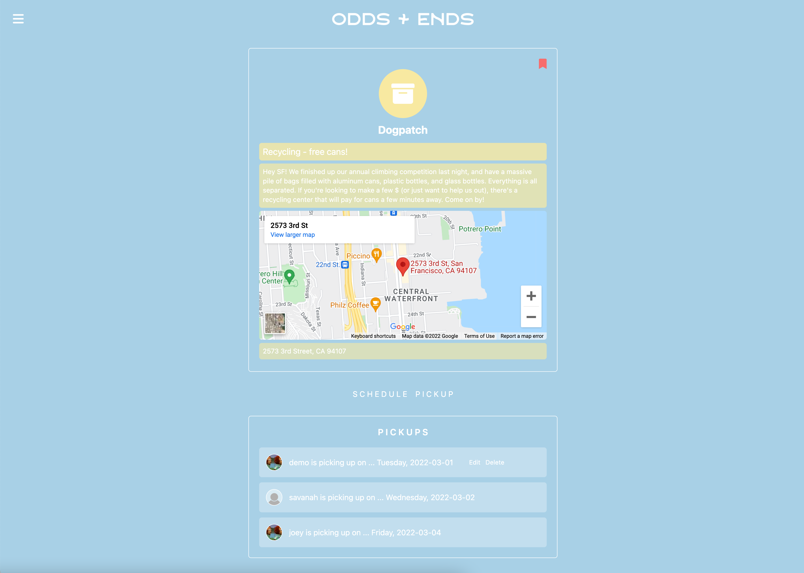
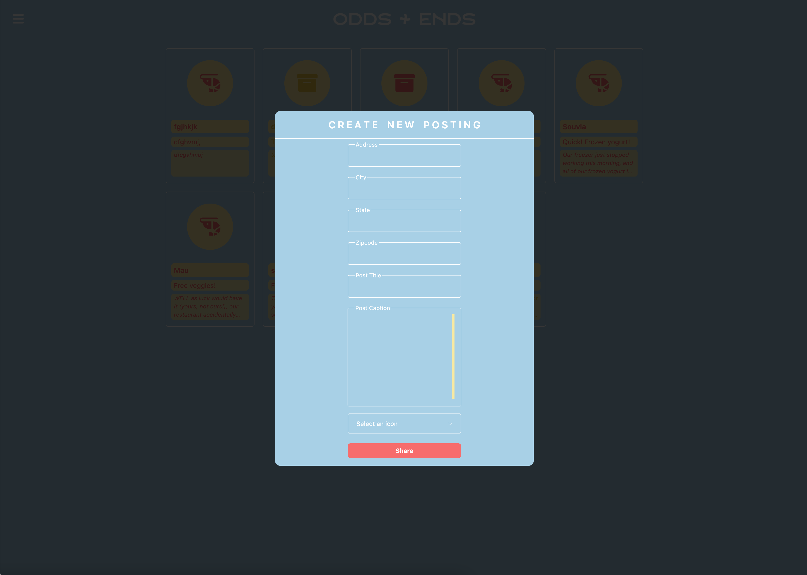
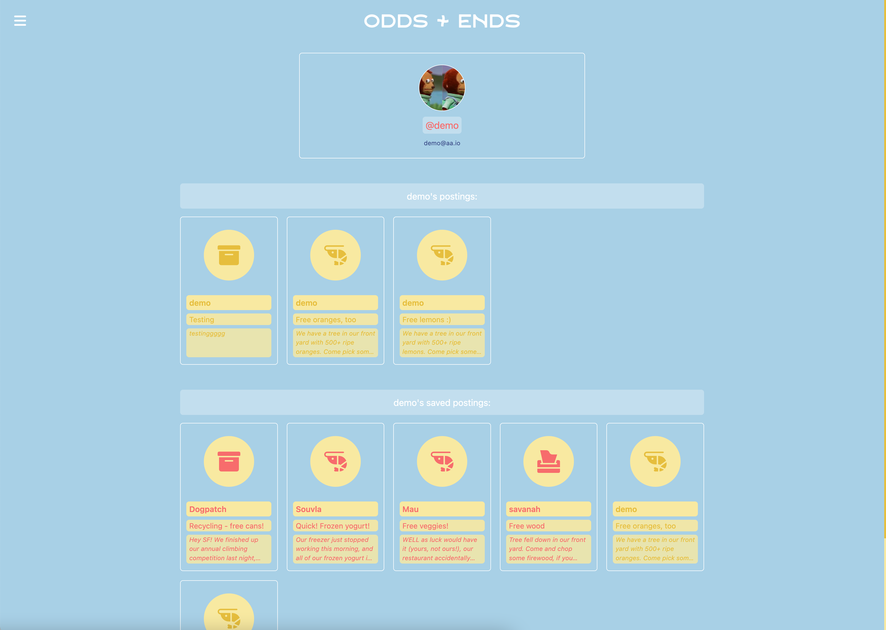

# Odds + Ends

Odds + Ends is an application loosely based on [Meta Marketplace](https://www.facebook.com/) + [Nextdoor](https://nextdoor.com/).

Check out Odds + Ends' live site: [Odds + Ends](https://odds-ends.herokuapp.com/login).


## Getting Started
To view and use this application, you can either navigate to the [live hosted site](https://flask-instagram-clone.herokuapp.com/) and login as a new or demo user, or download the project locally:
1. Clone this repository ```https://github.com/strewm/odds-and-ends.git```

2. Install dependencies in the main project folder ```pipenv install```

3. ```cd``` into ```/react-app``` and install dependencies ```npm install```

4.  Create a .env file based on the .env.example given

5.  Setup a PostgresSQL user + database in ```/python-project```
    ```javascript
    psql -c "CREATE USER <username> PASSWORD '<password>' CREATEDB"
    psql -c "CREATE DATABASE <database name> WITH OWNER <username>"
    ```

6. Start shell + migrate database + seed database + run flask in the main folder
    ```javascript
    pipenv shell
    flask db upgrade
    flask db migrate
    flask db seed all
    flask run
    ```

6. Keeping flask running, start the app by running ```npm start``` in ```/react-app```

7. Enjoy!

## Libraries Used


## Features
### Login + Signup
Login page with complete in-line error handling.


Sign up page with complete in-line error handling (shown).


### Home
Home feed, showing all active postings. Postings owned by the logged-in user are yellow, and all others pink.

Single posting page, with all scheduled pick-up dates below. Banner in upper right corner indicates a saved post by the logged-in user.


### Create posting
Create posting modal, with complete in-line error handling.


### User Profile Page
User profile, with ability to edit logged-in user's profile picture. Google maps embedded.


## Future Features
- Maps API
    - Users will be able to see a single posting's pin on a map
- Search
    - Users will be able to filter postings by location
